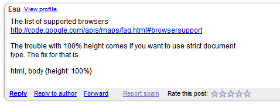
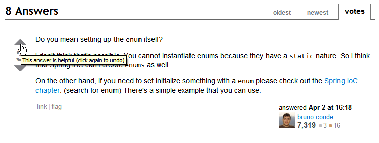
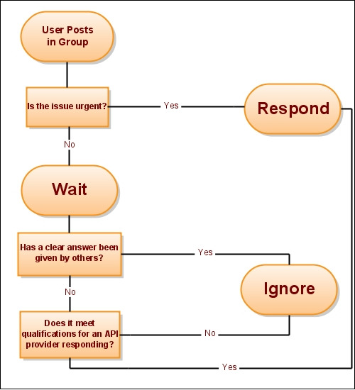

Forum Support
#############

As an API provider, your main goal should be making sure that
developers can successfully use your API. In a perfect world, a
developer could read through the documentation, look at some sample
code, and be able to write the exact app they were envisioning. But
the world isn't perfect, and more specifically, your API isn't
perfect and your documentation will never be 100% complete. In
fact, it is nearly impossible to predict how developers will want
to use your API, so it would be near impossible to document all the
myriad ways that your API could be used. So, you need to help your
developers out by providing a forum for them to ask questions
and get help in debugging their app.

Given infinite time, the eventual goal would be that the
documentation would cover all the frequently asked questions and
use cases in the group. But, resources
are limited, and providing good forum support will always be a big part
of making developers successful.

The eventual goal of an API support forum is for a community of
users to build up, and for these users to help eachother. Ideally,
the majority of posts are answered by super users that are
passionate about the API and enjoy helping others.

Forum Features
**************

There are various options for a discussion forum technology, each
of them with their own set of features. Here are some standard features
to look for:

* :ref:`email-subscription`: If you want developers responding to
  threads, they need an easy way to know when new threads are posted.
* :ref:`rss-feeds`: The more casual developers may prefer feeds,
  so they can browse new threads when they feel like it.
* :ref:`spam-handling`: Public forums are easily susceptile to spam,
  so good detection and moderation is a must.
* :ref:`poster-statistics`: Developers will be more likely to post
  if it contributes to a visible statistics.
* :ref:`badging-system`: But badging systems can often be even more
  effective than statistics.

Here are some of the forum options:

* `Google Groups`_: Includes email, RSS, and spam handling, but
  not much in the way of statistics or badging.
* `Stack Overflow`_: Full-featured, and with a great tiered badging
  system. The main flaw is that it is all one big global forum,
  and may be harder to form a tangible community around a particular API.
* `GetSatisfaction`_: Full-featured, and puts particular thought into
  the posting process. Distinguishes between posting questions, ideas,
  bugs, and praise; searches for similar questions; gives the poster
  tips for formulating their post; encourages adding tags and feelings
  to a post.
* `phpBB`_: Full-featured and open-source, it's one of the original
  posting systems on the web.
* `ZenDesk`_: Full-featured, and includes the ability to turn
  threads into one-on-one customer support tickets or into articles.

The features are discussed in more detail below, with references to
the various forum technologies that I myself have tried.

.. _Google Groups: http://groups.google.com
.. _Stack Overflow: http://stackoverflow.com
.. _GetSatisfaction: http://getsatisfaction.com
.. _phpBB: http://phpbb.com
.. _ZenDesk: http://zendesk.com

.. _email-subscription:

Email subscription
==================

In my experience, the most important feature for a developer forum is that users
can sign up to a forum via email, and respond via email. This means that there's
a low barrier for replying to questions, and that developers can use their email
or newsgroup reader of choice to manage their involvement in the group.

Some forums may not offer email subscription, but will email users when a reply
is made to their post, or perhaps email a summary of the week's content. This is
a step in the right direction, but I don't think it encourages users responding
to random posts as much as full email subscription does.

.. _rss-feeds:

RSS feeds
=========

It's nice if a forum offers the ability to subscribe to the latest topics and
posts in a forum. There are some developers that wouldn't be willing to
subscribe via email, but who will stick an RSS feed in their reader and glance
at it occasionally. An RSS feed is also handy for feeding into gadgets for API
landing pages or portals, and for doing analytics on (# of posts in a given
period).

.. _spam-handling:

Spam Handling
=============

Developer forums are generally setup in a way that encourages more members -
they are linked to from the documentation, blog posts, and the issue tracker,
and they do not require approval to join. All of this is great for encouraging
community, but unfortunately, it also is great for encouraging spammers.
Unfortunately, spammers can potentially destroy a community. If you subscribed
to a group and got 5 spammy messages from that group in the next day, you would
probably think to yourself "Well, I'm willing to sacrifice leaving this group if
it means not having to see those nasty messages in my inbox."

Ideally, a forum should have perfect spam detection, and either prevent spam
messages from going to the forum at all, or send them to a moderation queue for
you to approve/reject. If for some reason a message does get through, it should
be easy to remove the message and ban the poster.

Many forums do not have perfect spam detection, however, so they offer
moderation features to help prevent spam. For example, Google Groups gives a
group setting to moderate no posts, moderate the first post from a new user, or
moderate all posts. For the high-traffic, high-spam-target Maps API group, we
chose the second option. To make sure that developers do not have to wait too
long before their post is moderated, we have managers from all across the world
- US, UK, Australia. Some of the managers work for Google, but many of them are
our trustworthy top posters. Be careful who you give moderation access to -
some people are more ban-hungry than others, and will reject forum posts that
are not spam, but do not quite meet their standards. When in doubt, let
something through. It does not benefit you to be accused of censoring, and it
doesn't harm you if 1 or 2 spam posts get through each week.

.. _poster-statistics:

Poster Statistics
=================

People love getting awards or high scores and showing them off. It may be silly
and egotistical, but hey, that's the specialty of our species, and a forum can
take advantage of that feature/flaw to encourage people to post more. The basics
stats that any forum can expose are the join date (so you know who the old
timers are) and number of posts, and it does this both to encourage more posting
and to let new people understand the experience level of the others in a thread.

The screenshot below shows a standard PHPBB installation, being used for actual
PHPBB support. Next to each post, a short user profile is displayed with an
avatar, join date, number of posts, and join date.

|phpbb|

.. Ref: http://area51.phpbb.com/phpBB/viewtopic.php?f=72&t=31310

But keep in mind that providing just those basic stats can be deceiving.
Theoretically, a developer could post 1000 horribly uninformed posts, in an
attempt to feel good about himself (or just get massive amounts of help).
Luckily, this doesn't usually happen.  Either a bad developer becomes a good
developer in a much lower number of posts, or (un?)forunately, they realize that
they are not well suited for the technological task and move on.

Once in a blue moon, a poisonous developer may come along that defies the norms.
In the Maps API group, we once had a developer that would post paragraphs of
text that were not spam, but were just incredibly misinformed, and he would post
these in un-related threads (commonly termed "hijacking"). The others in the
forum first tried gently to teach him the ways of the forum, and then after it
became clear that he was not ever going to respect them, I put him on permanent
moderation and sent him an email informing him that we would let him back in as
long as he followed the guidelines. It's the only time I had to ban a non-spam
user, but I'm happy I took that extreme step. He was a poison to the community,
and he refused to rehabilitate himself. To bring this back to the original
discussion - he was also the top poster that month, according to our group stats
page. Short-term stats, like monthly top posters, are useful for finding
potentially rising stars in the forum, but will also point to newbies that don't
yet "get it" - so be careful how you use those stats.

Now, on the other hand, there are some highly experienced developers that don't
post often, but are incredibly knowledgeable when they do. This is often the
case for developers that are highly specialized in one area of the technology,
and thus only respond to very particular posts, or for developers with a
fluctuating work schedule, and only find time to post either when their work
calm downs, or when their work is actually using the technology heavily at the
time. It's hard to identify these developers from just their posting stats, but
it's usually easy to distinguish them by the quality of their few posts.

If a forum allows users to rate posts, then the average ranking of posts is also
a possible stat. The power of rating is a dangerous thing, however. It can be
used for good - identifying those who frequently provide good answers to posts,
but, more often than not, it can just as easily be used for bad- rating posts
down because the answer isn't what they wanted (even if it is correct). I got my
lowest rating on a post when I announced that we had a Flash API in the
JavaScript API forum, and that's when I learned that there are alot of hardcore
JS developers that absolutely hate Flash, and will punish you for even
mentioning it. This reflects a fundamental flaw in just providing a generic star
rating widget on a post, and not providing any guidance on its semantics. The
intended meaning should be "is this answer helpful?", but some users will take
it to mean "does this post give you information that makes you unhappy?", and
the rating information loses its utility.  The screenshot below shows the Google
Groups rating interface, which suffers from that problem:

|groupsrating|

.. Ref: http://groups.google.com/group/google-maps-js-api-v3/browse\_thread/thread/8b1c45197229950b

Ideally, a forum should provide more guidance on any feedback mechanism it
offers to posters, and then it will have more reliable data. Google Maps uses a
propietary forum technology for its support, and it has targeted it towards the
question-answer situation. In each reply to a post (each "answer"), the viewer
is presented with the question "Did this answer your question?  Yes/No", and
then that data is used to designate threads as answered in the list view.
Theoretically, this data could also be fed into the poster stats, but it's not
clear that it is.  The screenshot below shows a post that has been marked as
answering the question by one user:

|u2urating|

.. Ref: http://www.google.com/support/forum/p/maps/thread?tid=12cf111e77d6b0d4&hl=en

Stack Overflow, a specialized forum for programming issues, offers what is
probably the best rating interface. Next to each post, an up and down arrow is
displayed. Upon hovering over an arrow, the tooltip displays "This answer is
helpful" or "this answer is not helpful", so the user understands what their
vote means. In addition, only people with a reputation of "15" are allowed to
vote at all. Developers join reputation points by posting good questions or good
answers, and it only takes a few helpful posts to earn 15 points, so the bar is
set relatively low.  It may anger some newbies that they cannot rate posts, but
it likely helps their overall data by waiting for a user to
demonstrate that they understand the system and are willing to
contribute to the community. That voting data is then fed into the user's
overall reputation and also displayed in detail on their profile page.

The screenshot below shows an answer on a StackOverflow page.
Notice the tooltip over the up arrow, and the display of stats next to the
mini-profile for the responder.

|stackoverflow|

.. Ref: http://stackoverflow.com/questions/710392/using-spring-ioc-to-set-up-enum-values

Another issue with ratings is that people also tend to provide ratings more
often when they are feeling negative than when they are feeling positive - so
ratings will skew toward the lower end, and if there is not enough rating data,
then that skew may never be resolved. Google Groups suffers from lack of data,
likely because many of the posters subscribe via email and never see the rating
option in the web interface. In a web-only forum, it is likely that rating would
be much more common, particularly if it's as easy as clicking a few stars.

Everyone on the web seems to want to throw a rating widget on everything - it's
the democratic way, and it's the simplest form of feedback. But it's not that
simple, as you can now see. When using a forum with ratings or deciding whether
to enable ratings on your forum, keep the above lessons in mind.

.. |phpbb| image:: ./screenshot_phpbb.png

.. |u2urating| image:: ./screenshot_u2uratings.png

.. _badging-system:

Badging System
==============

A badging system can serve as an alternative or a supplement to a ratings
system. It can fulfill the goal of rewarding developers as well as the goal of
revealing the experience level of a responder, while avoiding the issues in
ratings. Typically, a forum will have various badge levels that a poster can
attain, and those levels will cover the spectrum of involvement from a new
member to an experienced developer to a group admin, and they may also denote
different types of involvement in addition to quantity of involvement.

For example, Ogre3d is an open-source game engine that uses PHPbb for their
forums, and they use the following badges: "Newcomer", "Familiar
Face","Regular", "Veteran", "OGRE Contributor" (an open-source committer),
"Bronze sponsor" (project donator), "OGRE Expert User", and "OGRE Moderator".
These badges are displayed next to the author's name on each post.
The screenshot below is from a post between a newcomer and a moderator in the
Ogre forum:

|ogre|

.. |ogre| image:: ./screenshot_phpbbbadges.png

.. Ref: http://www.ogre3d.org/forums/viewtopic.php?f=1&t=52312#wrap
.. TODO: Encouraging top posters
.. TODO: Encouraging good posting

Posting Guidelines
**********************

Even though the goal is for the forum to be dominated by user posts, a
representative from the API provider should always be monitoring the forum,
ensuring that it's healthy and that there are no questions that require their
answer. The users will feel good knowing that the API provider cares, and is
listening, even if they are not responding to every post. There's nothing worse
than an abandoned support forum, and you should do your best to make it clear
that you are there for them, when they actually need you.  Another reason for
monitoring the forum is to look out for major outages or bugs. In my experience,
a major bug will result in a flurry of posts in the forum in a short period of
time, and monitoring the forum is often the quickest way to find out about major
bugs.

Deciding When to Post
=====================

There are two situations where an API provider will post in the
forum. The first situation is when they are starting a new thread
themself, and that situation is described in more detail in the
"Communicating to Developers" section. The other situation is when
they are responding in a developer-initiated thread, and that is
what we'll cover here.

When deciding whether to reply to a thread, there are two things to
keep in mind:

-  It is nearly always preferred that an outside developer responds
   to a thread, as that encourages the idea that a forum is a
   community of super users, instead of a convenient way to mail the
   provider.
-  It is not scalable for a provider to respond to all questions.
   Debugging can take a lot of time, and some posters are particularly
   needy. A provider needs to prioritize their time to respond to the
   most pressing, intelligently asked questions.

Given those constraints, the below diagram shows the decision flow
for determining when and if to respond:

|groupdiagram|

When a user posts in the group, review the post to determine its
urgency. Basically, an urgent message would be one that signals a
major outage, and these will happen rarely (hopefully, otherwise
your API is in bad shape). If it is urgent, respond immediately to
say that you're looking to it, and if not, wait for a period of
time. This waiting time is to give other developers a chance to
respond to the post. Typically, I wait 2 days, but it could range
from 1-7 days. Once you've waited your preferred duration of time,
review the post again. If it has been answered by other developers,
and those developers have answered the post with good, complete
information, then you can archive it. If it either has not been
answered at all or if it has been answered, but the answers were
incorrect or unclear, then it becomes a candidate for you to
respond to.

The next step is to determine if the post meets qualifications for
an API provider responding. The qualifications exist to make sure
that the limited time you have is spent on the questions that are
the most important. Here is my criteria for when the provider
should absolutely respond:

-  The user is reporting a bug with the API or documentation.
-  You have information about a question that outside developers
   have no way of knowing. For instance, oftentimes someone posts that
   they are internally reaching the Static Maps API quota, and the
   super users typically respond that there is nothing that can be
   done. In fact, there is, so I will respond then and give them
   information on what to do.

In addition, you may also want to respond if the question seems
valid and particularly, if the question has come up multiple times
in the group without a good answer. Since developers often search
through the group when looking for answers to their questions, you
want to make sure that they don't search for a question and simply
find an unanswered thread. That can be one of the most frustrating
experiences for a developer that's desperate for a solution.

Composing You Reply
===================

When you do decide that a thread warrants your reply, here are some
tips to follow when composing the reply:

-  **Use a friendly, casual tone.** Say "thanks" when relevant, and
   don't be afraid to use smiley faces when it makes sense to.
   Remember, you want to make the forum into a positive place.
-  **Address the poster in your reply.** This both makes your reply
   seem more personal and caring, but it also makes it easier to read
   a thread when it forks into multiple tangents. If the poster signed
   with a name in their post, use that, otherwise use their username -
   e.g. "Hi Chris - " or "Hi dnk555 - ".
-  **Make your answers succinct.** Generally, nobody on the web
   wants to read more than a few paragraphs. At the same time, your
   answer shouldn't be so short that it provokes a slew of additional
   questions.
-  **Point to other resources when possible.** Oftentimes, a
   developer will ask the question, and an answer will be somewhere in
   the documentation - in the terms, in the FAQ, in the demo gallery,
   etc. The fact that they have asked the question indicates that they
   have not read that part of the documentation. That's not a criminal
   act - documentation can be daunting to read thoroughly - but it is
   something you want to encourage developers to do. So, always try to
   find the answer in the docs somewhere, and point the developers to
   that section. Check out this `example thread`_.
-  **Don't just post code - explain code.** Many questions in a
   forum are a developer asking how to do X and Y. It is tempting to
   just spit code back to them that they can plug-and-play, but it
   does not make them into a better developer, and in fact it makes
   them into a greedy developer that thinks they can use the forum as
   their code completion factory. Instead, you want to give them code
   and explain the principles behind it. They may still not get it,
   but atleast you've given them the chance to learn.
-  **Don't engage with emotions - just facts.** Some developers
   just aren't happy developers, and they will get emotional on the
   forums - particularly if you've just introduced a bug into their
   site. It will not help for you to get emotional in your response,
   and it will likely make the situation worse. Just address the
   technical issue at hand to the best of your ability.
-  **Don't predict the future.** A developer who is using your API
   is interested in two events in that may occur in the future: bugs
   being fixed, and features being fulfilled. As an official
   representative of the API, it is exceedingly dangerous to give a
   timeline for those events, or to even promise that they will occur.
   You may think that a feature is next on your to-do list, but then
   perhaps a natural disaster will strike, and it is now on the bottom
   (or, more realistically, you found a better feature to fulfill). If
   you tell a developer "Yes, we will do that, probably by date X",
   and then you do not make good on that, your developer will lose
   faith in your ability to deliver. It is much better to say "that
   sounds like a good idea, we'll look into it" and then surprise
   developers by delivering the feature. Bug fixes are a slightly
   different story, however, as 1) developers need to decide whether
   to invest time in a workaround, 2) the bugs are your fault, and you
   have an obligation to fix them. For bugs, I will usually tell
   developers when the actual code change is in that the bug is "fixed
   but not released", and for regression bugs, I will generally try to
   give an exact timeline for the fix. This policy will vary depending
   on the openness of a team, and you should decide for yourselves how
   much you are willing to promise/reveal to developers.
-  **Keep a unified front.** If there are multiple representatives
   from your API posting in the forum, it is exceedingly important to
   act as a cohesive team. If another representative posts something
   that is incorrect, do not reply in the group and correct them.
   Instead, email that person and explain the error, and suggest a
   follow-up reply for them, e.g. "Update: I've looked into it more
   and realized.. " or "I've chatted with the team, and in fact, ...".
   If a developer posts on an issue that you want fixed, but perhaps
   the rest of your team disagrees (it happens!), do not make a
   comment to that affect. The safest thing to say is always that the
   team is "looking into" or "considering" the issue at hand. Your
   developer community should see you as a team that works well
   together and makes good shit happen. Don't lose their faith!

.. _example thread: http://groups.google.com/group/google-maps-api-for-flash/browse_frm/thread/eaee4361c3085278

Posting Templates
=================

Here are some template responses for common tricky questions:

**Q**: When will this feature come out? Are you working on it?

A: "Our policy at [Company X] is to never disclose the timeline for
upcoming products, features, or bug fixes. "
"Please stay tuned to our blog (or changelog) for info on new
features."

**Q**: I'm experiencing this bug with the service.

A: "I've been able to reproduce that and can confirm it is a bug.
[Company X] Engineers (or 'We') are looking into it.

**Q**: I think that so and so feature would be a great addition.

A: "That's an interesting idea, thanks for sharing it here. I've
shared it with the team."

